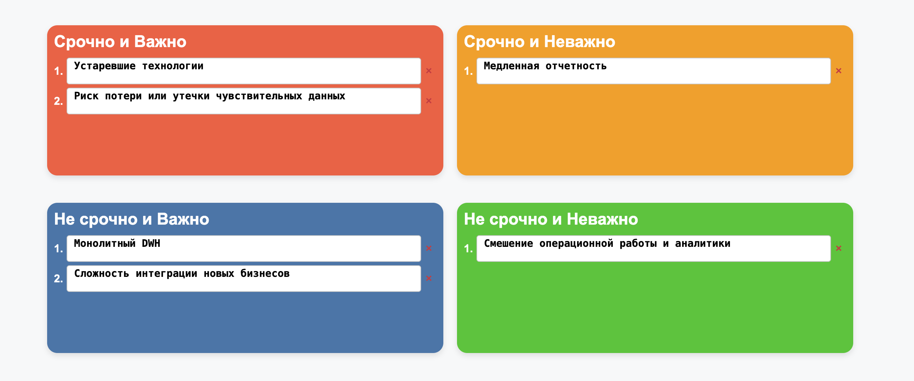

# Будущее 2.0

### Опишите проблемные места текущего ландшафта

| Проблемное место                                  | Описание для бизнеса                                                                                                                               | Описание для инженеров                                                                                                                                                                   |
| :------------------------------------------------ | :------------------------------------------------------------------------------------------------------------------------------------------------- | :--------------------------------------------------------------------------------------------------------------------------------------------------------------------------------------- |
| **1. Монолитный DWH**          | Главное хранилище данных стало слишком большим и медленным, там всё свалено в кучу – трудно и долго что то найти. | MS SQL Server 2008 используется и как OLTP (для PowerBuilder), и как OLAP, хранит разнородные данные, сотни ТБ.                                               |
| **2. Медленная отчетность**                       | Сотрудники часами ждут нужные отчеты, что замедляет принятие решений и снижает эффективность работы.                                                  | Большой объем данных и сложные трансформации внутри DWH приводят к длительному выполнению запросов.                                                      |
| **3. Сложность интеграции новых бизнесов**        | Присоединение новых компаний будет очень долгим и дорогим, так как текущую систему сложно расширять.                     | Добавление новых источников и потребителей данных требует значительных доработок существующего DWH.                                       |
| **4. Устаревшие технологии**                      | Мы используем устаревшие программы, это небезопасно и ограничивает нас.  | MS SQL Server 2008 (нет поддержки, уязвимости), Power Builder (устаревший фреймворк).                                                                              |
| **5. Смешение операционной работы и аналитики**   | Система, которой пользуются операторы в клиниках для ежедневной работы, и система для анализа данных – это одно и то же, что замедляет работу обоих отделов | Прямой доступ операторов клиник через Power Builder к DWH создает OLTP-нагрузку на аналитическое хранилище, ухудшая производительность обеих задач                                  |
| **6. Риск потери или утечки чувствительных данных** | Хранение всех данных, включая очень чувствительные медицинские, в одной большой системе увеличивает риски                | Отсутствие разделения хранения и обработки данных повышает риски компрометации данных.                             |

### Приоритизируйте выявленные проблемы

Используем матрицу Эйзенхауэра (Срочность/Важность)

**Срочно и Важно:**
- **Устаревшие технологии** - критические уязвимости безопасности
- **Риск потери или утечки чувствительных данных** - соответствие требованиям безопасности

**Не срочно и Важно:**
- **Монолитный DWH** - архитектурная проблема требует долгосрочного решения
- **Сложность интеграции новых бизнесов** - стратегическое развитие компании

**Срочно и Неважно:**
- **Медленная отчетность** - можно временно решить оптимизацией

**Не срочно и Неважно:**
- **Смешение операционной работы и аналитики** - можно решить позже через разделение доступов
